# seco

seco ("server controller") is a little library to provide a way to control a server while it is running.
See [main.cpp](main.cpp) for an example.

The server simply creates a `seco::Listener` that starts a background thread that will listen for commands, sent from another process via `seco::control`.

As I did in the example, I recommend using the same process as the server and the command line parser you are already using for the control process.

It consists of a single [header](include/seco.hpp) and [source file](src/seco.cpp) that you can simply include in your build or use CMake's `add_subdirectory`, `target_include_directories` the [include](include) directory and `target_link_libraries` `seco`.
